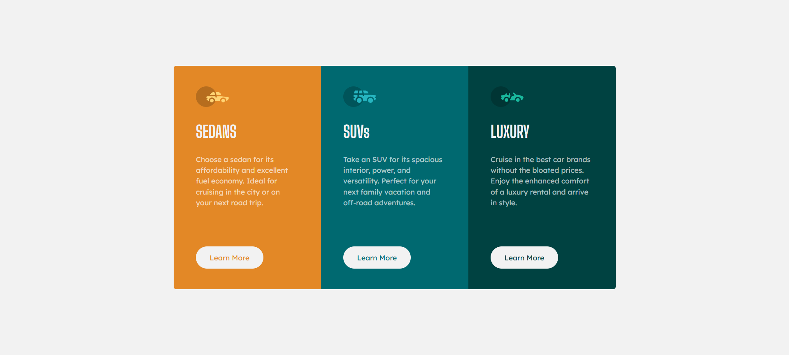

# Frontend Mentor - 3-column preview card component solution

This is a solution to the [3-column preview card component challenge on Frontend Mentor](https://www.frontendmentor.io/challenges/3column-preview-card-component-pH92eAR2-).

## Table of contents

- [Overview](#overview)
  - [The challenge](#the-challenge)
  - [Screenshot](#screenshot)
  - [Links](#links)
- [My process](#my-process)
  - [Built with](#built-with)
  - [What I learned](#what-i-learned)
  - [Continued development](#continued-development)
  - [Useful resources](#useful-resources)
- [Author](#author)
- [Acknowledgments](#acknowledgments)

---

## Overview

### The challenge

Users should be able to:

- View the optimal layout depending on their device's screen size
- See hover states for interactive elements

### Screenshot

### Links

- Solution URL:{https://www.frontendmentor.io/solutions/responsive-3-column-card-component-with-flexbox-PZuflPUeX0}
- Live Site URL: [https://esabdul.github.io/3-column-preview-card-component/]

---

## My process

### Built with

- Semantic HTML5
- CSS custom properties
- Flexbox
- Mobile-first workflow
- Media queries using `clamp()` for responsiveness
- Accessibility enhancements (e.g., visually hidden headings)

### What I learned

- Use `clamp()` to make elements adapt to screen width
- Align elements responsively between breakpoints using media queries
- Apply BEM naming convention for clean CSS structure
- Use accessibility techniques like visually hidden headings

### Continued development

Areas I want to focus on in future projects:

- More advanced layouts using CSS Grid
- Improving accessibility (ARIA roles, semantic structure)
- Writing cleaner, more reusable CSS

### Useful resources

- [CSS Clamp Explained – Josh W Comeau](https://www.joshwcomeau.com/css/clamp/) – Helped me understand how to use `clamp()` effectively
- [MDN Web Docs - Flexbox](https://developer.mozilla.org/en-US/docs/Web/CSS/CSS_flexible_box_layout/Basic_concepts_of_flexbox) – My go-to guide for layout

---

## Author

- Frontend Mentor - [@Esabdul](https://www.frontendmentor.io/profile/Esabdul)
- GitHub - [@Esabdul](https://github.com/Esabdul)

---

## Acknowledgments

Thanks to the Frontend Mentor community and MDN Web Docs for all the help and resources during the challenge.
